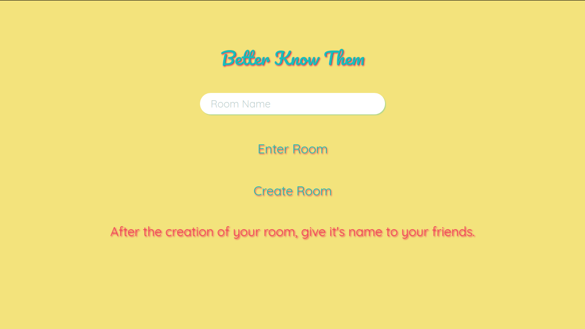

How it works:

A room is created, when there are more than 2 people it starts automatically.

Every 30 seconds:

1 - A person asks a question

2 - User responses to the previous question are shown

3 - Nobody knows who's who

4 - The answers are always shown in random order (They are inside squares that in turn are inside a space shown on the screen), so the user's answer does not stay in the same place so that there are no patterns that can be analyzed.

You can say what you want about who you want, asking and answering what you want.

